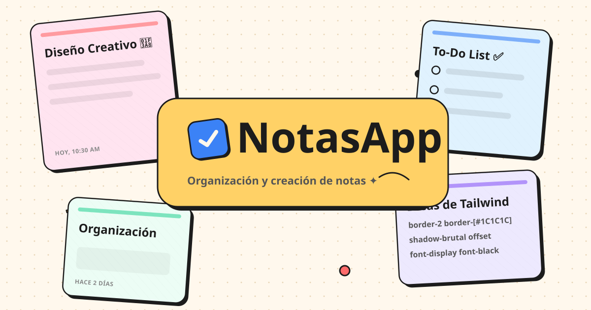
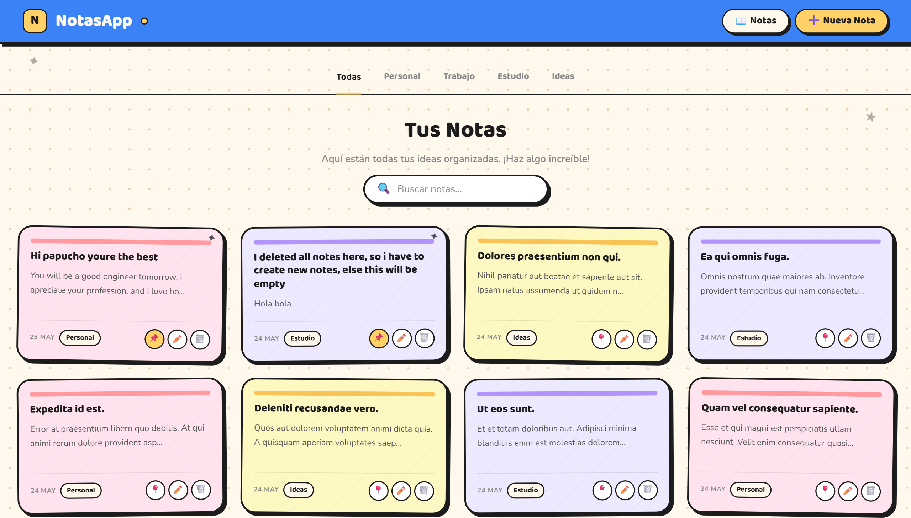
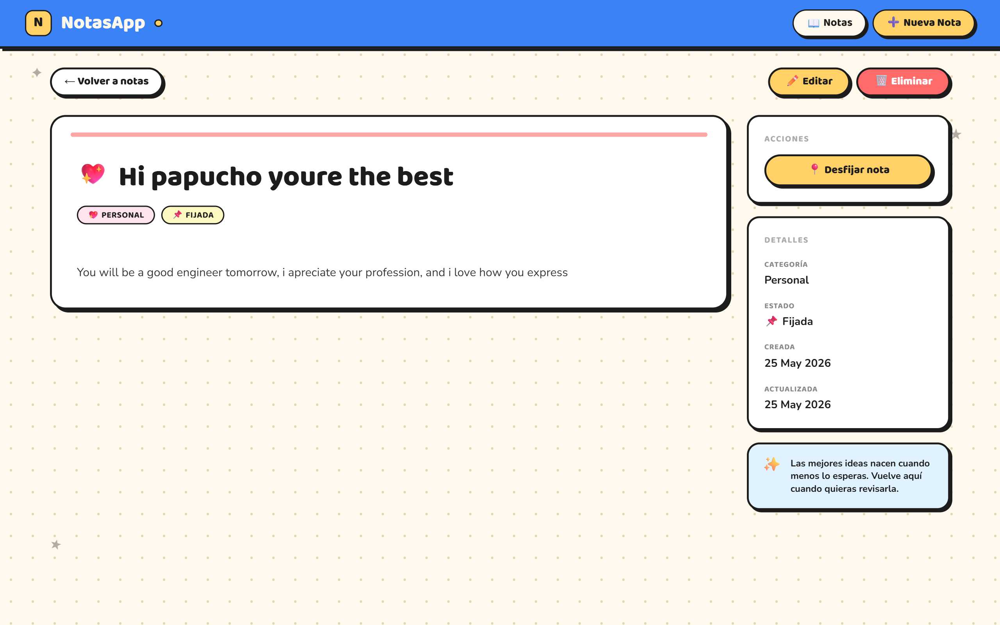
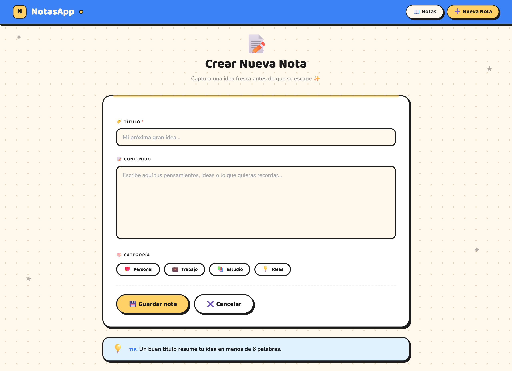
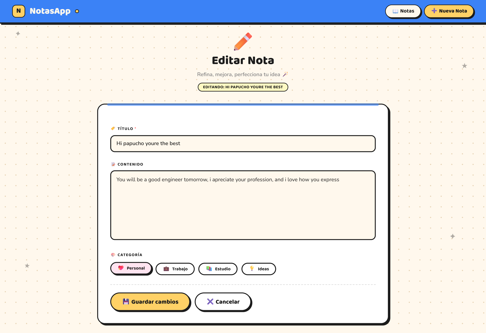
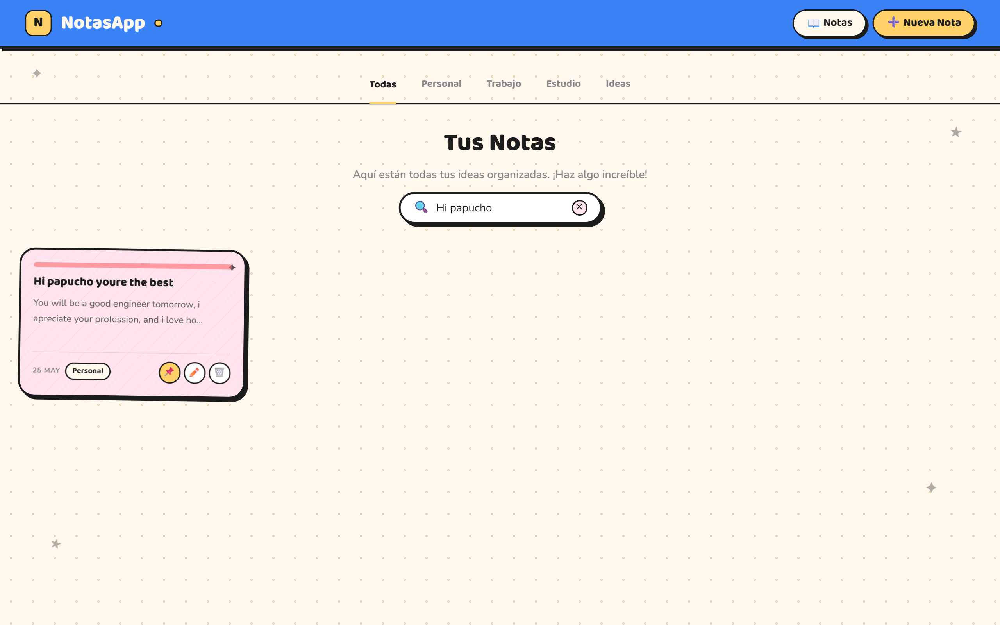
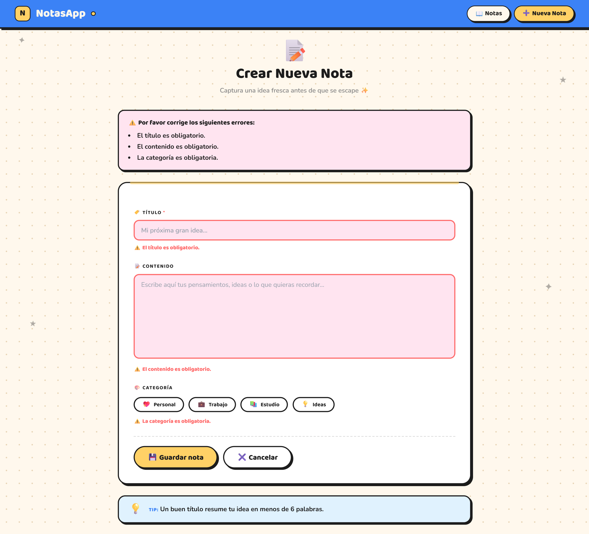

# 📝 Notas App — CRUD Inteligente de Notas con Laravel 13

<p align="center">
  
</p>

<p align="center">


</p>

---

<p align="center">
  🌐 <strong><a href="https://notas-app-t7u2.onrender.com/">Ver aplicación desplegada</a></strong>
</p>

---

# 📚 Descripción del Proyecto

**Notas App** es una aplicación web desarrollada con Laravel 13 que permite gestionar notas y recordatorios mediante operaciones CRUD completas, búsqueda dinámica y una interfaz moderna e interactiva.

El proyecto fue desarrollado aplicando arquitectura MVC, validaciones backend y despliegue en producción utilizando Render y PostgreSQL.

> **INF560 — Desarrollo Web Backend**  
> Universidad Autónoma Tomás Frías

---

# ✨ Funcionalidades Principales

✅ CRUD completo de notas  
✅ Crear, editar, visualizar y eliminar notas  
✅ Sistema de notas fijadas 📌  
✅ Buscador dinámico 🔍  
✅ Validaciones con FormRequest  
✅ Mensajes flash interactivos  
✅ Interfaz moderna con TailwindCSS  
✅ Mascota interactiva 🐱  
✅ Factories y Seeders  
✅ Arquitectura MVC  
✅ Despliegue en producción con Docker + Render  
✅ Base de datos PostgreSQL  
✅ Responsive Design

---

# 📸 Capturas del Proyecto

## 🏠 Página Principal



---

## 📝 Visualización de Nota



---

## ➕ Crear Nota



---

## ✏️ Editar Nota



---

## 🔍 Sistema de Búsqueda



---

## ⚠️ Validaciones Backend



---

# 🧠 Tecnologías Utilizadas

| Tecnología | Descripción |
|---|---|
| Laravel 13 | Framework backend principal |
| PHP 8.5 | Lenguaje de programación |
| PostgreSQL | Sistema gestor de base de datos |
| TailwindCSS | Framework CSS |
| Blade | Motor de plantillas |
| Docker | Contenerización del proyecto |
| Render | Despliegue y hosting |
| Git & GitHub | Control de versiones |

---

# 🏗️ Arquitectura del Proyecto

```txt
notas-app
│
├── app
│   ├── Http
│   │   ├── Controllers
│   │   └── Requests
│   ├── Models
│   └── Providers
│
├── database
│   ├── factories
│   ├── migrations
│   └── seeders
│
├── public
│   └── images
│
├── resources
│   └── views
│       ├── layouts
│       └── notas
│
├── routes
│
├── Dockerfile
│
└── README.md
```

---

# 🗄️ Modelo de Base de Datos

```txt
┌─────────────────────────┐
│         notas           │
├─────────────────────────┤
│ id            BIGINT PK │
│ titulo        VARCHAR   │
│ contenido     TEXT      │
│ categoria     VARCHAR   │
│ fijada        BOOLEAN   │
│ created_at    TIMESTAMP │
│ updated_at    TIMESTAMP │
└─────────────────────────┘
```

---

# 🔥 Funcionalidades Destacadas

## 📌 Sistema de Notas Fijadas

Las notas importantes pueden fijarse para mostrarse primero en la página principal.

---

## 🔍 Buscador Inteligente

El sistema permite buscar notas mediante:

- título
- contenido
- categoría

---

## 🐱 Mascota Interactiva

La aplicación incorpora una mascota virtual que mejora la experiencia del usuario mediante interacción visual y mensajes dinámicos.

---

## ⚡ Validaciones Backend

Las validaciones fueron implementadas usando:

- FormRequest
- Reglas personalizadas
- Mensajes personalizados

---

# 🛡️ Validaciones Implementadas

✔️ Título obligatorio  
✔️ Máximo 120 caracteres  
✔️ Validación de tipos de datos  
✔️ Protección CSRF  
✔️ Validaciones backend con Laravel  
✔️ Sanitización de formularios

---

# 🧪 Datos de Prueba

El proyecto utiliza:

- Factories
- Seeders

para poblar automáticamente la base de datos y facilitar pruebas.

---

# 📌 Rutas Principales

| Método | Ruta | Descripción |
|---|---|---|
| GET | `/notas` | Listar notas |
| GET | `/notas/create` | Formulario de creación |
| POST | `/notas` | Guardar nota |
| GET | `/notas/{nota}` | Ver nota |
| GET | `/notas/{nota}/edit` | Editar nota |
| PUT | `/notas/{nota}` | Actualizar nota |
| DELETE | `/notas/{nota}` | Eliminar nota |

---

# 🚀 Instalación del Proyecto

## 1️⃣ Clonar repositorio

```bash
git clone https://github.com/abdair-coca/Notas-App.git
```

---

## 2️⃣ Entrar al proyecto

```bash
cd Notas-App
```

---

## 3️⃣ Instalar dependencias

```bash
composer install
npm install
```

---

## 4️⃣ Configurar entorno

```bash
cp .env.example .env
```

---

## 5️⃣ Generar APP_KEY

```bash
php artisan key:generate
```

---

## 6️⃣ Configurar PostgreSQL

Editar `.env`

```env
DB_CONNECTION=pgsql
DB_HOST=127.0.0.1
DB_PORT=5432
DB_DATABASE=notas_app
DB_USERNAME=postgres
DB_PASSWORD=tu_password
```

---

## 7️⃣ Ejecutar migraciones y seeders

```bash
php artisan migrate:fresh --seed
```

---

## 8️⃣ Compilar assets

```bash
npm run build
```

---

## 9️⃣ Iniciar servidor

```bash
php artisan serve
```

---

# 🐳 Despliegue con Docker

El proyecto fue desplegado utilizando Docker y Render.

## Construir contenedor

```bash
docker build -t notas-app .
```

---

## Ejecutar contenedor

```bash
docker run -p 8000:8000 notas-app
```

---

# 🌐 Producción

Aplicación desplegada en:

👉 https://notas-app-t7u2.onrender.com/

---

# 📖 Aprendizajes Obtenidos

Durante el desarrollo de este proyecto se fortalecieron conocimientos sobre:

- Arquitectura MVC
- Laravel 13
- Eloquent ORM
- Validaciones backend
- PostgreSQL
- TailwindCSS
- Blade Templates
- Docker
- Render Deployment
- Git y GitHub
- Buenas prácticas backend

---

# 👨‍💻 Autor

## Abdair Coca

Estudiante de Ingeniería Informática  
Universidad Autónoma Tomás Frías

---

# ⭐ Conclusión

Este proyecto permitió desarrollar una aplicación web completa utilizando tecnologías modernas del ecosistema PHP, aplicando correctamente el patrón MVC, despliegue en producción y buenas prácticas de desarrollo backend moderno.